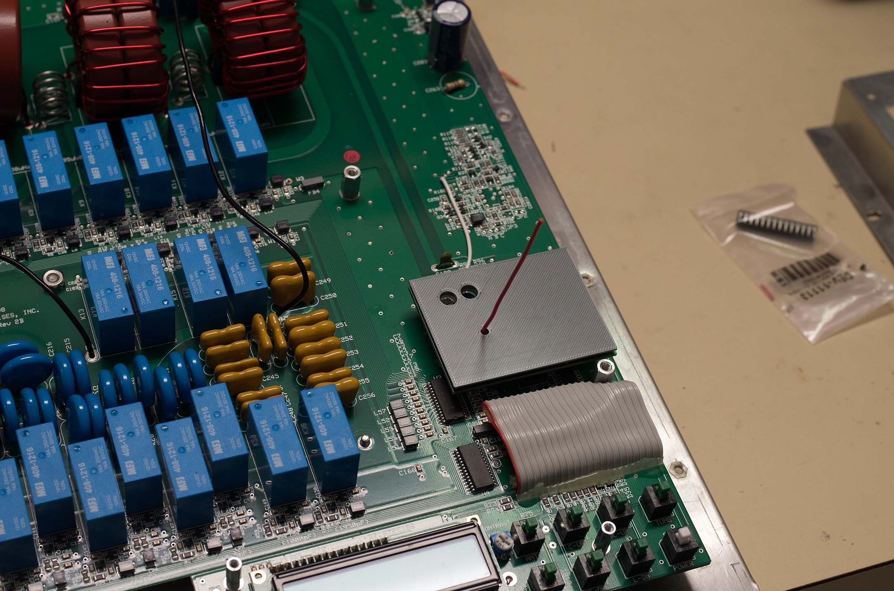

<h1>MFJ998 tuner modifications.</h1>

Read <a href="LICENSE">LICENSE</a>.

Applying this modification <i><b>CAN</b></i> and <i><b>WILL</b></i> void the
manufacturer's warranty. It introduces risks to itself and your antenna and transmitter beyond those in the manufacturer's
firmware. Use of this PCB and sketch <i><b>CAN</b></i> and <i><b>WILL</b></i> 
damage any and all of these:
<ul>
<li>The MFJ998 tuner itself and components in it.
<li>Any coax cables connected to this tuner's input and/or outputs.
<li>Any antennas connected via those cables.
<li>Any transmitting and/or amplifier equipment connected to those cables.
</ul>

<h2>The Story</h2>
This project's origins can be traced back a couple years when lightning 
rendered my MFJ998RT inoperative, taking me off of 160 meters. I have lots
of experience with lightning damaging my equipment and I know its almost aways
a waste of time to try to repair it. I ordered a replacement tuner and put the dead 
one on my work bench. Eventually I took off the cover. And it occurred to me
that all the "big" parts, the relays, the inductors and capacitors, were 
probably not damaged by lighting. MFJ publishes the circuit diagram on their
website, so I started out by noticing the 5V regulator had exploded and went
from there. 
After many months
of working on it part time, I replaced one more IC (the main PIC18 uProc was the last one) and
it came up! Its as good as new. Here is the pile of dead semiconductors that
came off the lightning-struck board.

Now that I know something about how the tuner works, maybe I can improve it for my own
use?

Why replace the as-designed PIC microprocessor?

In contesting scenarios, I found I could not always get the MFJ998RT
to quickly tune to match at the frequency I wanted, and having to
put a low power signal to it to force the tune causes QRM
and takes time. This project adds a <a href='https://learn.sparkfun.com/tutorials/rfm69hcw-hookup-guide'>RFM69HCW 915MHz Wireless Transceiver</a> 
with a maximum range of 500m. It allows direct telemetry of the
tuner's state in both directions from the main operating shack. The
tuner, for example, can be commanded to set itself to an operating
frequency without sending any RF down its coax.

Design rationale

I chose the Arduino for the daughterboard because it is
inexpensive, I am familiar with the development environment, and
its pinout is more than enough to replace all the necessary
functions for the remote version of the tuner. 

<h2>Installation</h2>
<ol>
<li>Remove the weatherproof cover. 
<li>Remove the shield that covers the PIC18 uProc.
That shield has three #6 machine screws, each with a locknut, three #4 machine screws,
each with a locknut, and a #6 nut.
<li>Carefully pry the 28 pin PIC18 IC out of its socket. This is a "no holes" modification, so save the IC and you can restore factory operation by replacing it.
<li>Install this daughterboard as shown in the photo. Caution: it is possible to be
off-by-one row when pressing the daughterboard's header into the 28 pin socket. 
Use a flashlight and peer underneath before you apply power! 

<li>The tranceiver's antenna must extend straight up, at a right angle to the PCB. Don't worry about how it will get through the shield. There already is a hole for it.
<li>Place the 3D printed spacer part over the PCB. Its purpose is to insulate the
PCB traces from the shield.

<li>Put the unit back together, first the shield and then the weatherproof cover.

</ol>

<h2>Operation</h2>
The daughterboard sketch has some primitive functions available on the push button panel and LCD display,
but its primary purpose is to be controlled from the shack PC. <a href='Mfj998Desktop/Mfj998Desktop'>Here</a> is the source code to a Windows application.

<h2>Construction</h2>
The surface mount components, minus the RFM69 transceiver, are
installed first. Hints for reflow soldering: the gerber file solder paste mask thinks you're going to reflow
 solder the RFM69, but it cannot be in the oven. I put a tab of masking tape over its holes in my
solder paste mask. Also, the Revision 2 solder paste mask omits the mask holes necessary for C1, C2, and C3, so I hand-applied more paste after pulling the mask off.

Install <b><i>only</i></b> the headers at the PIC position
and the Arduino position. There are several incorrect orientations
possible! It is impossible to fix a soldered-in header in the
wrong orientation. The header pins go into the board from the 
same side the SMDs are mounted, and the <i>short</i> header pins 
solder into the board. The bottom side of the board, then,
has nothing on it, and the short pins of the headers protruding.
 Here are step by step pictures. Use a jig of some sort to keep the headers at right angles to the PCB. I started with the ones for the PIC position.

Check the PCB and header pin orientation. This is your last chance. Solder the PIC headers. 

My jig won't accommodate both the Arduino and PIC headers, so I improvised. Only one row of
Arduino headers at a time.

The first Ardunio header is soldered in while maintaining a right angle.

I used the Arduino as a jig to hold the headers for soldering its remaining headers.

No soldering is done at this step! Now flip the PCB over without losing the loose Arduino nor its headers.

The Arduino drops down to the work surface, but the soldering happens on what is now the top of the PCB.

I only soldered one or two pins on each of the three headers so I could take a peek at the other side before committing all the pins. Then finish soldering all the Aruduino headers to the PCB (the ones you can see in the photo below), but do not solder in the Arduino yet!

<h3>Test now. Do not finish assembly</h3>
Its time to try TestHarnessSketch running on my Mega. There are a lot of jumpers required.
See the details in <a href='TestHarnessSketch/TestHarnessSketch.ino'>TestHarnessSketch.ino</a>.

I used two ribbon cable 10 pin male-to-female jumpers, one for all the PIC header jumpers (shown above) and another 
for all those to the Arduino header jumpers.

Plug each of the jumpers where it belongs in the Mega. Again, see the sketch at <a href='TestHarnessSketch/TestHarnessSketch.ino'>TestHarnessSketch.ino</a> to see which jumper connects to which pin..

Finally, all the jumpers for both sets of headers.

With only the SMD components installed (minus the RFM69, which
cannot go in the reflow oven) use jumper wires between the
partially assembled daughterboard with no arduino, and not
plugged into the MFJ998 motherboard. See the TestHarnessSketch
for detailed instructions for the jumpers. Only the RFM69 test
fails. If anything else fails, this is your last chance to
fix the SMD soldering!

<blockquote>
<code>
<pre>
All Tests
EEPROM write to address 0 and 0xfff0
EEPROM read from address 0 and 0xfff0
EEPROM write other values to address 0 and 0xfff0
EEPROM read from addresses
Init FREQ_DIV4 counter
FREQ_DIV4 counter high OK
FREQ_DIV4 input low OK
Got F/4
MSCP23S08 registers
   0x0 =0xFF
   0x1 =0x0
   0x2 =0xC0
   0x3 =0x80
   0x4 =0xC0
   0x5 =0x8
   0x6 =0xBF
   0x7 =0x40
   0x8 =0xFF
   0x9 =0xBF
LCD bits set to 0x1. LCD4 OK LCD5 OK LCD6 OK LCD7 OK
LCD bits set to 0x2. LCD4 OK LCD5 OK LCD6 OK LCD7 OK
LCD bits set to 0x4. LCD4 OK LCD5 OK LCD6 OK LCD7 OK
LCD bits set to 0x8. LCD4 OK LCD5 OK LCD6 OK LCD7 OK
Initial iSPI is OK (high)
Read pins 0xbf correct (PD is only low input)
extender WAKEUP_PIN OK (went low)
WAKEUP_PIN is in interrupt mask. OK
extender removed iSPI on WAKEUP high, OK
extender PD_PIN HIGH OK
Extender interrupt on PD high, OK
RFM69 TEST FAILED***********************
</pre></code></blockquote>

Solder the RFM69 transceiver into place. Add its antenna per the
the notes <a href='https://learn.sparkfun.com/tutorials/rfm69hcw-hookup-guide'>here</a>. Note that the TestHarnessSketch
likely will no longer run without external power applied to your
Test Machine (a Uno or Mega is recommended). USB-supplied power is
insufficient to power the daughterboard once the RFM69 is in place.

<blockquote><code><pre>
MFJ998 daughter test harness (rev02)
Type A to test All. E to EEPROM, X to test extender, F for frequency divider

All Tests
EEPROM write to address 0 and 0xfff0
EEPROM read from address 0 and 0xfff0
EEPROM write other values to address 0 and 0xfff0
EEPROM read from addresses
Init FREQ_DIV4 counter
FREQ_DIV4 counter high OK
FREQ_DIV4 input low OK
Got F/4
MSCP23S08 registers
   0x0 =0xFF
   0x1 =0x0
   0x2 =0xC0
   0x3 =0x80
   0x4 =0xC0
   0x5 =0x8
   0x6 =0xBF
   0x7 =0x40
   0x8 =0xFF
   0x9 =0xBF
LCD bits set to 0x1. LCD4 OK LCD5 OK LCD6 OK LCD7 OK
LCD bits set to 0x2. LCD4 OK LCD5 OK LCD6 OK LCD7 OK
LCD bits set to 0x4. LCD4 OK LCD5 OK LCD6 OK LCD7 OK
LCD bits set to 0x8. LCD4 OK LCD5 OK LCD6 OK LCD7 OK
Initial iSPI is OK (high)
Read pins 0xbf correct (PD is only low input)
extender WAKEUP_PIN OK (went low)
WAKEUP_PIN is in interrupt mask. OK
extender removed iSPI on WAKEUP high, OK
extender PD_PIN HIGH OK
Extender interrupt on PD high, OK
RFM69 test passed
All tests passed
</pre></code></blockquote>
<h3>Finish assembling</h3>
Now its OK to solder in the Arduino. Install a right angle header on the 6 pin side of the Arduio Pro Mini. See the photo for the required orientation. This header is used
to program the device.

The red wire is the transceiver's antenna.

<h2>Install the sketch software</h2>
Use the Arduino IDE to install mfj998sketch. The daughterboard must not be 
plugged into the motherboard to program it through its 6-pin header. 

Note: the Arduino serial port
is routed through the daughterboard to the MFJ998's back panel serial connector, but without the DTR pin
that the Arduino IDE uses to reset the device at programming time. The
Arduino can be programmed as installed in the motherboard using a serial cable
to the MFJ998's back panel using careful timing of the power switch and 
the Arduino "upload" button. See the Arduino documentation.
 
<h3>CAD</h3>
The CAD and STL directories contain the 3D designs of a couple
of plastic parts that might be useful.

Mfj998rtTerminalCover.STL

In my installation, the antenna is a wire connected to the tuner's
wire terminal input, and the tuner is mounted with that hole facing
up, and therefore with rainfall exposure. When not in use, I move
the antenna wire to the adjacent grounded wingnut and pop this
plastic part to offer better weather protection to the wire terminal.

Mfj998LcdSpacer2.STL

Lightning destroyed the LCD in my MFJ998RT. I found the manufacturer's
soldered-in header extremely difficult to remove with the dead part.
To install the new device, I did not use a header but instead soldered
12 individual two inch long AWG 24 solid insulated wires for pins 1-6
and 11-16. Pins 7-10 are not used in the original. That resulted in an LCD
that can be uninstalled relatively easily, but is not held in place
securely. Print the part above and it properly frames the LCD in the 
window in the aluminum shield.

<h3>MFJ998RT versus the MFJ998 indoor version.</h3>

While the main PCB on the MFJ998RT is nearly identical to the indoor version
of the tuner, the MFJ998, and the daughterboard could obviously be
plugged into that indoor version, this sketch does not support 
everything needed for the indoor version's operation. The PCB
hardware connects all the same signals to the Arduino that were
available to the original PIC processor, so maybe you can modify
this code to be useful on the indoor model.

MFWD and MREF are routed to the Arduino, but are not supported by this sketch.
The START line is also routed (it comes from the PIC band selector uProc
on the motherboard) but 
is not supported in the sketch published here. The communication protocol for that PIC uProc is
not, as far as I know, published by MFJ.

